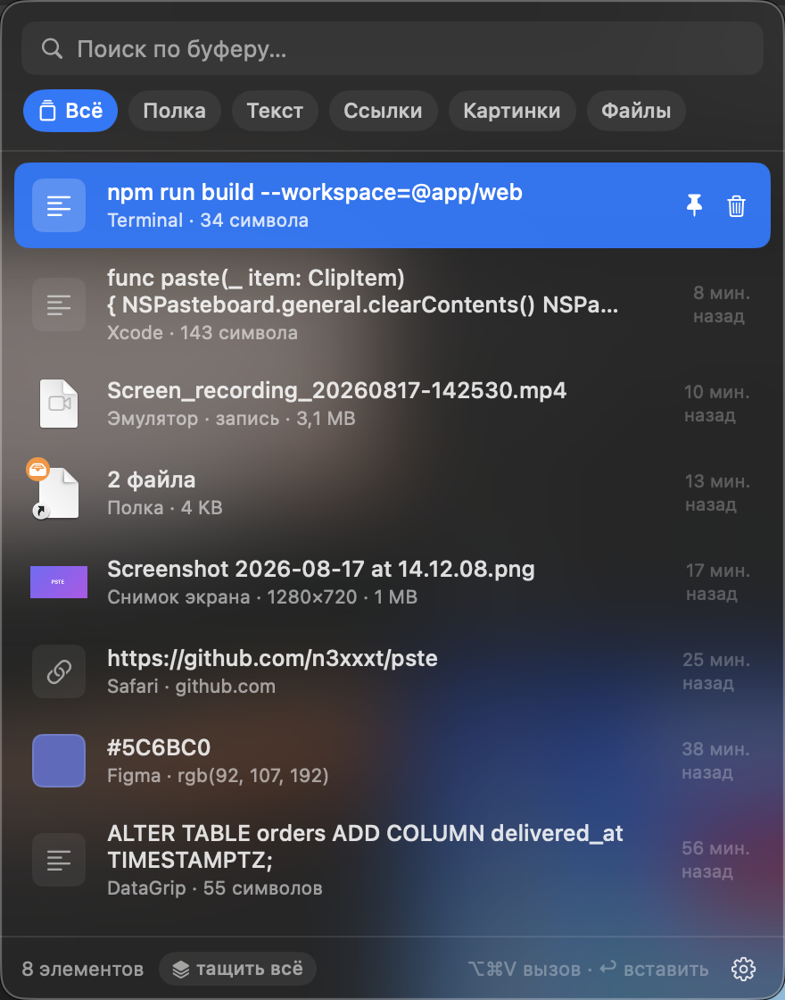

# PSTE

Менеджер буфера обмена и «полка» для перетаскивания — одно приложение в строке меню.
Всё хранится локально: без облака, аккаунтов и обращений к сети.

[English version](README.md)



## Зачем ещё один менеджер буфера

Большинство хорошо умеют историю и на этом останавливаются. PSTE вдобавок работает
полкой: бросил файлы на иконку в строке меню, дошёл до другого приложения, вытащил их
оттуда. И заодно перехватывает то, что обычно засоряет рабочий стол — снимки экрана и
записи из Android-эмулятора — складывая их прямо в буфер обмена.

## Что умеет

**История буфера обмена**
- Текст, форматированный текст, ссылки, HEX-цвета, изображения, файлы.
- Поиск, фильтры по типу, закрепление, автоочистка по лимиту (50…∞ записей).
- Пароли не сохраняются: содержимое с меткой `org.nspasteboard.ConcealedType`
  (1Password, Bitwarden, Keychain и др.) пропускается.

**Полка (drag & drop)**
- Перетащите файлы **на иконку в строке меню** — полка распахнётся под курсором.
- Перетащите что угодно **в открытое окно** — ляжет на полку с оранжевой меткой.
- Перетащите элемент **из окна наружу** — в Finder, редактор, чат. Работают файлы
  (сразу пачкой), изображения, текст, ссылки.
- «Тащить всё» в подвале окна вытаскивает весь текущий список одним движением.
- Картинки из браузера и вложения из почты принимаются через file promises —
  файл копируется в `~/Library/Application Support/PSTE/Dropped`,
  поэтому остаётся доступным и после закрытия исходного окна.

**Скриншоты**
- Новый снимок экрана автоматически попадает в буфер обмена и в историю.
- Рабочий стол остаётся чистым: файл снимка переезжает в хранилище PSTE
  под своим именем, так что его можно перетащить оттуда куда угодно или
  сохранить через «Сохранить как…». Отключается галочкой
  «Не оставлять снимки на рабочем столе» — тогда файл остаётся на месте.
- Пока PSTE не запущен, снимки сохраняются как обычно — системные
  настройки macOS не меняются.

**Android-эмулятор**
- Снимки экрана и записи видео из эмулятора (кнопки камеры и «Record and
  Playback», а также сохранение из Android Studio в эту папку) забираются
  автоматически: картинка попадает в буфер как изображение, видео — как файл,
  готовый к ⌘V в чат, Finder или редактор.
- Работает без настройки: пока PSTE запущен, папка сохранения эмулятора
  (`com.android.Emulator` → `set.savePath`) указывает на его собственный
  каталог, поэтому на рабочем столе ничего не появляется. При выходе из
  PSTE прежний путь возвращается на место.
- Записи ждут окончания: файл забирается только когда перестал расти, поэтому
  недописанное видео не попадёт в полку.
- Отключается галочкой «Забирать снимки и видео из Android-эмулятора».

## Управление

| Действие | Как |
|---|---|
| Открыть/закрыть полку | ⌥⌘V или клик по иконке |
| Навигация | ↑ / ↓ |
| Вставить выбранное | ↩ |
| Быстрая вставка | ⌘1 … ⌘9 |
| Удалить запись | ⌘⌫ |
| Переключить фильтр | ⇥ |
| Сбросить поиск / закрыть | Esc |
| Меню элемента | правый клик по строке |

Сочетание можно переназначить: **шестерёнка → «Сочетание вызова…»**, затем нажать
нужные клавиши (минимум один модификатор либо F1–F20). Регистрируется глобально
через Carbon, поэтому не требует разрешений, а если сочетание занято другой
программой — приложение об этом скажет. По умолчанию именно ⌥⌘V, а не ⌘⇧V:
второе почти везде означает «Вставить без форматирования», и глобальный перехват
отобрал бы эту команду у всех приложений.

## Настройки

Шестерёнка в правом нижнем углу: автовставка в активное окно, закрытие после
копирования, автозапуск при входе, перехват скриншотов, лимит истории, очистка.

Автовставка (⌘V за пользователя) требует разрешения
**Системные настройки → Конфиденциальность → Универсальный доступ**.
Без него элемент просто копируется в буфер.

## Установка

```bash
git clone https://github.com/n3xxxt/pste.git
cd pste
./build.sh --install  # собрать, установить в /Applications и запустить
```

`./build.sh` без аргументов просто оставит бандл в `./build/PSTE.app`.

Требуется Xcode 15+ и macOS 14+. Приложение подписывается ad-hoc — при первом
запуске из Finder может понадобиться «Открыть» через контекстное меню.

Отладочный вывод (геометрия окна, поиск приёмника перетаскивания):

```bash
PSTE_DEBUG=1 ./build/PSTE.app/Contents/MacOS/PSTE
```

## Устройство

| Файл | Ответственность |
|---|---|
| `Model.swift` | элемент истории, хранилище блобов, форматирование |
| `ClipReader.swift` | единый разбор `NSPasteboard` для буфера и drag & drop |
| `ClipboardMonitor.swift` | опрос `changeCount` системного буфера |
| `CaptureWatcher.swift` | наблюдение за папками снимков и эмулятора |
| `EmulatorCapture.swift` | перенаправление папки сохранения эмулятора |
| `Store.swift` | история, дедупликация, поиск, персистентность, превью |
| `PanelController.swift` | плавающая панель, позиционирование, автовставка |
| `StatusItemController.swift` | иконка в строке меню и приём файлов на неё |
| `DragSourceView.swift` | вытаскивание элементов наружу |
| `DropCatcherView.swift` | приём перетаскивания, включая file promises |
| `ContentView.swift` / `ClipRow.swift` | интерфейс |

Данные лежат в `~/Library/Application Support/PSTE`.

## Лицензия

MIT — см. [LICENSE](LICENSE).
